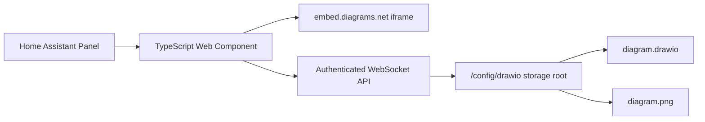
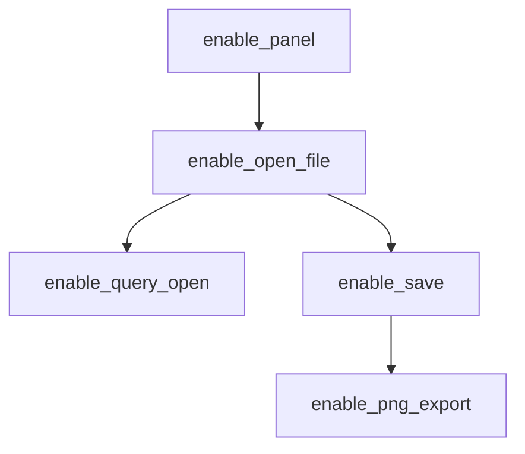
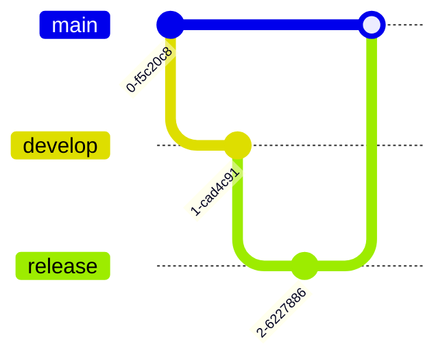

# 🧭 Draw.io Editor for Home Assistant

[](https://github.com/visaodeempresa/ha-diagram-drawio-editor/actions/workflows/ci.yml)
[](https://github.com/visaodeempresa/ha-diagram-drawio-editor/releases)
[](https://hacs.xyz/)
[](LICENSE)

Bring diagrams.net directly into Home Assistant and keep the full workflow in one place: open a `.drawio` file, edit it online inside the Home Assistant UI, save it back to disk, and optionally generate a sibling `.png` automatically. ✨

This repository is maintained by **Visao de Empresa**, with a practical focus on Home Assistant delivery, clean rollout strategy, and real operational usability instead of demo-only integrations.

## 🚀 Highlights

- Edit `.drawio` and `.xml` files without leaving Home Assistant.
- Run the editor inside a dedicated Home Assistant panel.
- Generate a sibling `.png` on save with the same basename as the diagram.
- Roll out features gradually with isolated flags.
- Install as a HACS custom integration or copy manually to `custom_components`.
- Validate quality with TypeScript checks, Python compilation, HACS validation, hassfest, and automated GitHub Releases.

## 🧱 Architecture



The frontend is written in TypeScript, but the project is intentionally **not** pure TypeScript. Home Assistant custom integrations require a Python backend layer to register the panel, validate file paths, and persist diagram and PNG files.

## 🌱 Controlled Rollout

Feature rollout is the core design principle of this project.



Available flags:

- `enable_panel`
- `enable_open_file`
- `enable_query_open`
- `enable_save`
- `enable_png_export`

Recommended rollout:

1. Enable only `enable_panel`.
2. Confirm the panel loads correctly in Home Assistant.
3. Enable `enable_open_file` and `enable_query_open`.
4. Test opening diagrams from Lovelace buttons.
5. Enable `enable_save`.
6. Confirm diagram persistence.
7. Enable `enable_png_export`.
8. Confirm the sibling PNG is generated.

## 🔀 GitFlow Delivery Model

This repository follows a simple GitFlow-aligned branch strategy:



- `develop`: active delivery branch
- `release`: release stabilization branch
- `main`: production branch with published releases

## 📦 Installation

### HACS custom repository

1. Add this repository as a custom repository in HACS with category `Integration`.
2. Do not select `Dashboard`. This repository includes a Home Assistant backend layer and is published for the `Integration` category.
3. Install `Draw.io Editor`.
4. Restart Home Assistant.
5. Add the integration from `Settings > Devices & Services`.

### Manual install

1. Copy `custom_components/ha_drawio_editor` into your Home Assistant `custom_components` directory.
2. Restart Home Assistant.
3. Add the integration from `Settings > Devices & Services`.

You do **not** need to run Node.js just to install the integration manually. The frontend bundle is already committed to the repository.

## ⚙️ Initial Setup Fields

- `storage_path`: Relative storage root inside the Home Assistant config directory.
- `panel_url_path`: URL segment for the custom panel.
- `sidebar_title`: Sidebar label shown in the sidebar.
- `sidebar_icon`: Material Design Icons identifier.
- `editor_url`: diagrams.net embed URL or a compatible self-hosted URL.

Suggested first-run values:

- `storage_path`: `drawio`
- `panel_url_path`: `ha-drawio-editor`
- `sidebar_title`: `Draw.io`
- `sidebar_icon`: `mdi:vector-polyline-edit`
- `editor_url`: keep the default value unless you host your own diagrams.net instance

## 🧪 Usage Examples

### Open an existing diagram from a Lovelace button

See [examples/button-open-diagram.yaml](examples/button-open-diagram.yaml).

### Open the bundled sample house map

The integration provisions `samples/mapa-vertical-2D_v2.drawio` into the configured storage root on setup if the file does not already exist.

See [examples/button-open-mapa-vertical-2D_v2.yaml](examples/button-open-mapa-vertical-2D_v2.yaml).

### Open a path that will be created on first save

See [examples/button-create-or-edit-diagram.yaml](examples/button-create-or-edit-diagram.yaml).

### Paste a ready-to-use Lovelace quick-start stack

See [examples/lovelace-quick-start.yaml](examples/lovelace-quick-start.yaml).

## 🛠️ Development

```bash
npm ci
npm run check
python -m compileall custom_components
```

## 🤖 GitHub Actions

GitHub Actions are used to keep the repository consistent end to end:

- `CI`: TypeScript validation, bundle verification, Python compilation, HACS validation, and hassfest.
- `Release`: automatic GitHub Release generation from `main`, including a packaged integration artifact.

## 📚 Documentation

- English architecture notes: [docs/architecture.md](docs/architecture.md)
- Portuguese architecture notes: [docs/architecture.pt-BR.md](docs/architecture.pt-BR.md)
- English references: [docs/references.md](docs/references.md)
- Portuguese references: [docs/references.pt-BR.md](docs/references.pt-BR.md)

## 📄 License

MIT. See [LICENSE](LICENSE).
